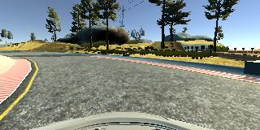
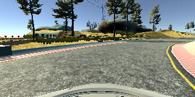
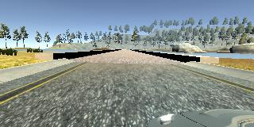
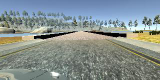

# Project 3: Behavioral cloning

### Remarks

#### Version 2
* After the review comment concerning BGR-Images on NN-training and RGB-Images in the simulation the NN was retrained using RGB-Images logically resulting in a change on network performance. Therefore the line ```img = img[:,:,::-1]``` was added to the generator function[see modelV2.py]
* The new saved model can be found in ./saved/modelV2.h5
* Images were added to the Data preparation and augmentation section as required in the review.
* A new video was recorded for 2 laps meeting the condition of the car entirely being within the track [see videoV2.mp4]. In order to keep the car inside the track higher steering angle penalties (0.35 instead of 0.15) were applied to left and right images. By applying higher penalties the vehicle became more 'reactive' and driving smoothness decreased.

#### Version 1
* The saved model.h5 can be found in the ./saved directory as well as other saved nn from the Trial section
* a video was recorded for a few laps, the file is called video.mp4
* The model.py file was created from the jupyer notebook model.ipynb and the outputs were deleted. It is also viewable as model.ipynb and model.html
* The drive.py file was added, it is the default file from the CarND github repo
* The NN was tried on the second track falling of the track immediately. The NN was also retrained with 2 Laps clockwise and 2 Laps counterclockwise(as recorded on the first track) with no possitive effect.The data recorded for the submission can be found in the ./recdata directory, the recorded data of track2 has been excluded.
* *UPDATE* ./recdata was removed due to restriction of number of files

## Data collection

In order to collect an appropriate amount of data 2 Laps clockwise und 2 Laps counter clockwise where manually driven on Track1 trying to stay around the middle of the track.
The data capture resulted in 2080 images counter clockwise and 1707 images clockwise with corresponding steering angles giving a total of 3787 images.

## Data preparation and augmentation

Data augmentation was done by using the images of all 3 cameras mounted to the vehicle and applying penalties of 0.15 to the steering angles for the left and right images enhancing the total number of samples to 11361. 
To generate even more data, the array containing the samples was duplicated and marked for the images to be flipped horizontally and multiply the steer angle by -1 in the generator. The effect is shown in following images:

Clockwise driving image recorded by central camera: normal(left) and flipped(right):



Counterclockwise driving image recorded by left camera: normal(left) and flipped(right):



The data preparation, specifically normalization and cropping, was applied to the beginning of the Network as Lambda and Cropping2D layers. The details will be given in the section describing the Behavioral Cloning Network (Model architecture).

## Data generation 

To give the network training the ability to handle a large amount of data a *generator* was implemented. The generator takes a list of all samples consisting of the image file paths on the aws vm and corresponding steer angles. The paths were corrected to work on aws vm during csv read operation and appended to the sample-list at first. Within the generator the images are read into the current batch and flipped horrizontally if desired. Finally features and labels are converted to numpy arrays and a batch is returned for network training.

## Model architecture

After trial of different network architectures(see trial section) a finally architecture was chosen with appropriate performance.
For data preparation means a normalization layer was added taking the input image shaped(160,320,3) and normalizing it for each pixel to be in range of [-0.5,0.5]. Then a cropping layer was used as the second layer cropping the image(70px off top, 25px off bottom) to retrieve the region of interest.

The actual network consists of a convolutional layer as first layer using (6,8,14) convolutions with strides of (2,2) and 'relu' activation. This layer is follow by an inception layer merging (3,3,8) and (5,5,8) convolutional layers and a (3,3) MaxPooling layer. The final layer is a fully connected layer outputting the steering angle.

Note: Using more than one Dense Layers seems to make the network "underreact"

## Overfitting prevention

In order to prevent overfitting the network dropout was applied to the nn at two stages. The first dropout of 10% was used after the first convolutional layer. The second dropout affects the output of the entire inception module with a dropout of 25%. The dropout layers had a significant positive effect on the network performance.

## Model summary

The complete network architecture is viewed using:
```
model.summary()
```
outputting:
```
____________________________________________________________________________________________________
Layer (type)                     Output Shape          Param #     Connected to                     
====================================================================================================
input_1 (InputLayer)             (None, 160, 320, 3)   0                                            
____________________________________________________________________________________________________
lambda_1 (Lambda)                (None, 160, 320, 3)   0           input_1[0][0]                    
____________________________________________________________________________________________________
cropping2d_1 (Cropping2D)        (None, 65, 320, 3)    0           lambda_1[0][0]                   
____________________________________________________________________________________________________
convolution2d_1 (Convolution2D)  (None, 30, 157, 14)   2030        cropping2d_1[0][0]               
____________________________________________________________________________________________________
dropout_1 (Dropout)              (None, 30, 157, 14)   0           convolution2d_1[0][0]            
____________________________________________________________________________________________________
convolution2d_2 (Convolution2D)  (None, 30, 157, 8)    120         dropout_1[0][0]                  
____________________________________________________________________________________________________
convolution2d_4 (Convolution2D)  (None, 30, 157, 8)    120         dropout_1[0][0]                  
____________________________________________________________________________________________________
maxpooling2d_1 (MaxPooling2D)    (None, 30, 157, 14)   0           dropout_1[0][0]                  
____________________________________________________________________________________________________
convolution2d_3 (Convolution2D)  (None, 30, 157, 8)    584         convolution2d_2[0][0]            
____________________________________________________________________________________________________
convolution2d_5 (Convolution2D)  (None, 30, 157, 8)    1608        convolution2d_4[0][0]            
____________________________________________________________________________________________________
convolution2d_6 (Convolution2D)  (None, 30, 157, 8)    120         maxpooling2d_1[0][0]             
____________________________________________________________________________________________________
merge_1 (Merge)                  (None, 30, 157, 24)   0           convolution2d_3[0][0]            
                                                                   convolution2d_5[0][0]            
                                                                   convolution2d_6[0][0]            
____________________________________________________________________________________________________
dropout_2 (Dropout)              (None, 30, 157, 24)   0           merge_1[0][0]                    
____________________________________________________________________________________________________
flatten_1 (Flatten)              (None, 113040)        0           dropout_2[0][0]                  
____________________________________________________________________________________________________
dense_1 (Dense)                  (None, 1)             113041      flatten_1[0][0]                  
====================================================================================================
Total params: 117,623
Trainable params: 117,623
Non-trainable params: 0
____________________________________________________________________________________________________
```

An advantage of this network architecture is the small number of only 117 623 trainable parameters giving a model.h5 of around 1.4 mb.

## Model training

The model was trained using Adaptive Moment Estimation (Adam) optimizer minimizing the mean square error (mse) during training. A batch size of 128 was used. An epoch count of 5 was used to train the model.

## Conclusion

After running the model for a few laps the stability of the network can be confirmed. The driving performance is not too rough in comparison to other network architectures tested.

##### Possible improvements

The network architecture is not very deep and only has few parameters. Application of a deeper network containing i.e. more inception modules could improve the vehicle's performance. In addition more data could be captured to train the network or different augmentation methods could be applied. After taking a close look at the data many images with zero steering angle were observed. Considering this fact a further promising way to improve performance would be to generate more data on the 'critical' parts of the track meaning sharp corners or other parts only appearing for short time periods to level out the zero-steeringangle-data.

## Trial

Multiple architectures were applied and the model architectures for each network can be found in Networksummaries.html. The stored network .h5 can be found in ./saved directory.
An overview of the network performances is given in the following table:

| Network | Performance\* | Point of failure\*\* | comment |
|:---|:-:|:---|:---|
|Net001.h5|0|immideatly|poor performance high steering angles|
|Net002.h5|0|immideatly|seems smoother than Net001.h5|
|Net003.h5|0|immideatly|like Net002.h5|
|Net004.h5|3|at bridge|Drives high steering angles in sharp corners|
|Net005.h5|5|first dirt curb directly after bridge|Very smooth steering(low angels)on straight tracks|
|Net006.h5|2|first corner|does not steer over 1 %|
|Net007.h5|6|after bridge to the left|smooth steering, but large enough angles to get round sharp curves|
|Net008.h5|7|after bridge to the right|extremly smooth steering|
|Net009.h5|6|after bridge to the right|oversteers(looks like sine), same topology as Net007.h5|
|Net010.h5|5|first sharp corner to the right|
|Net011.h5|7|-|performance not ideal, but made whole track|
|Net012.h5|8|-|performance not ideal, but made whole track|
|Net013.h5|5|first sharp corner to the right|oversteering|
|Net014.h5|3|hit Bridge|oversteering on yellow line, not middle of road|
|Net015.h5|9|-|good performance. Didn't leave lane once|
|Net016.h5|6|first sharp corner to the right|smooth steering|
|Net017.h5|8|-|Drives over yellow marking|

\* Performance is a personal rating in range 0-10, 0 being very poor, 10 being very good

\*\* Point of failure describes the position the vehicle left the road
