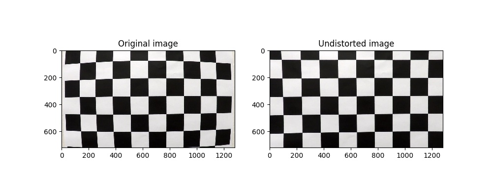
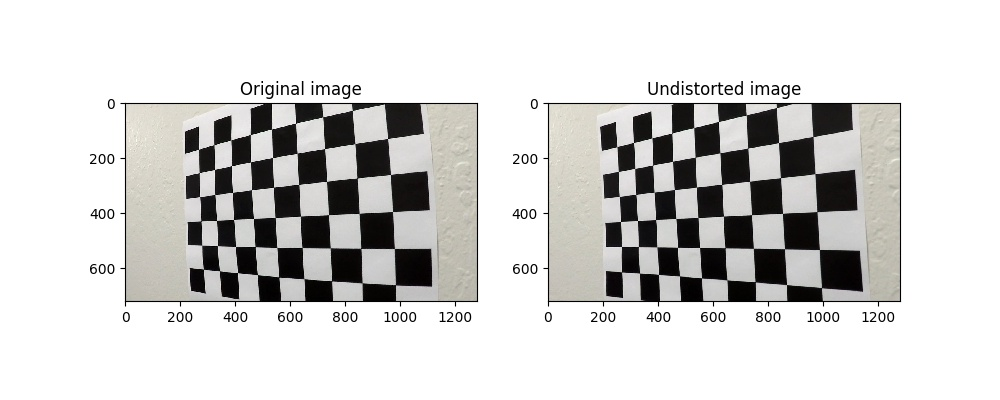
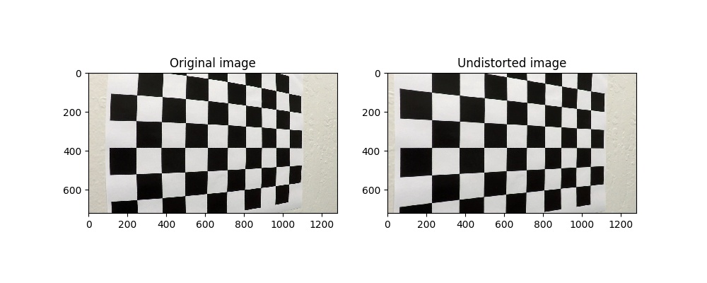
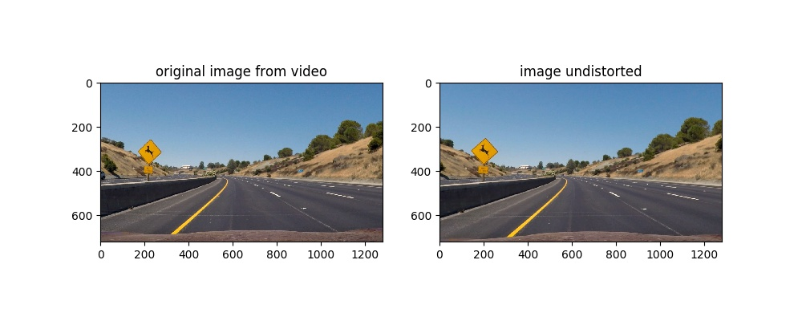
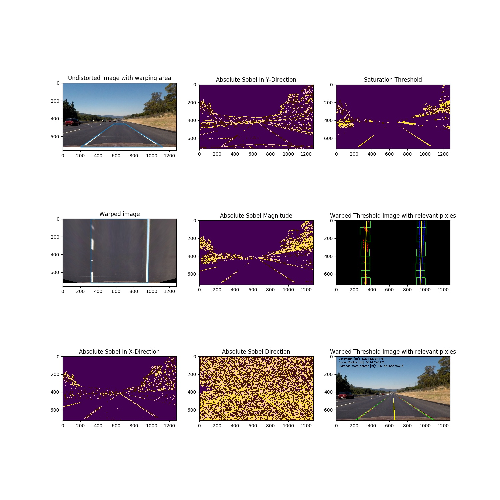
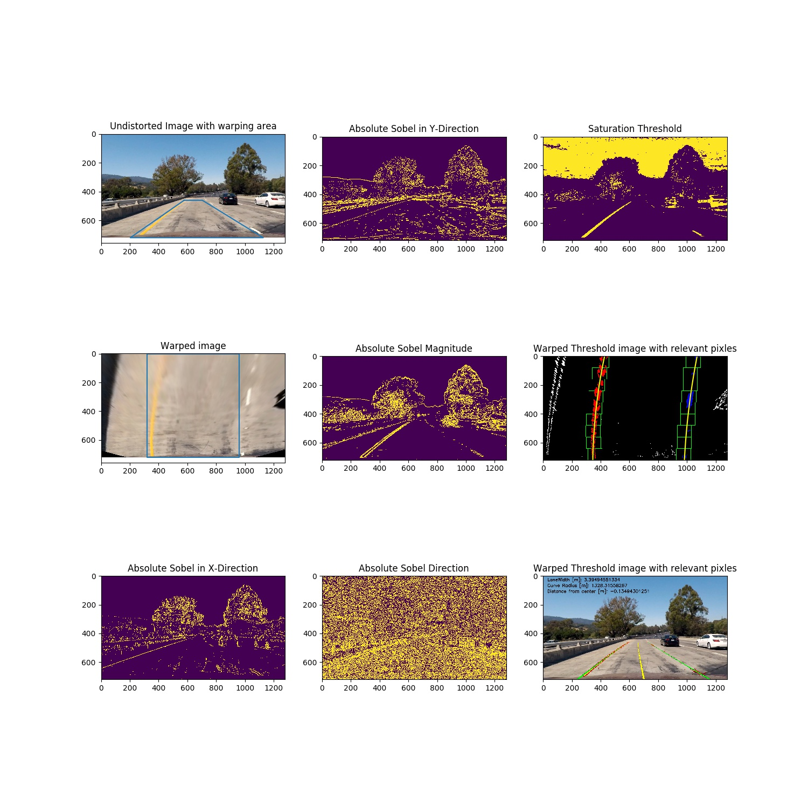
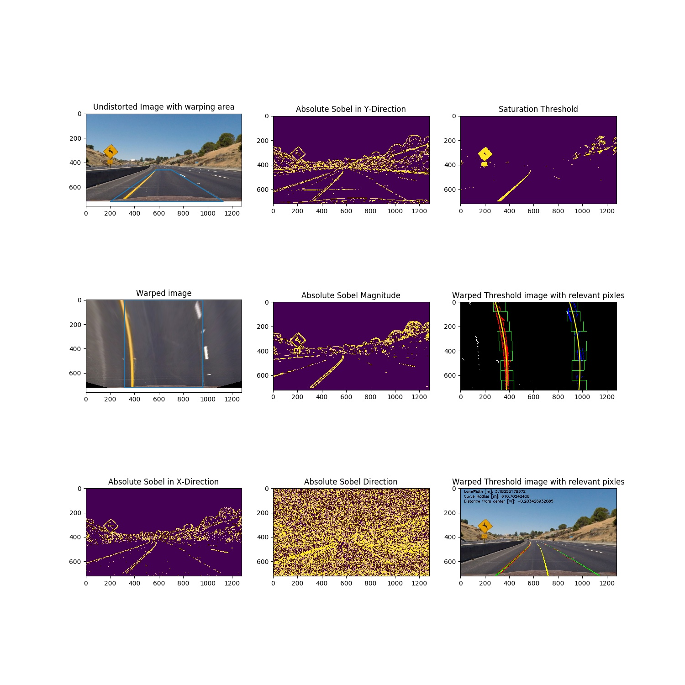

# Project 4 Advanced Lane Lines

### Remarks
* All code can be found in ```advancedLaneLines.py```. It consists of 3 classes [cameraCalibrator,laneline,lanFinder] and the important lines are commented 
* All imagescreated are in the ./img directory
* The video for the project submission is called project_video_augmented.mp4
## 1 Camera calibration
To execute camera calibration a class ```cameraCalibrator``` was defined taking in the path of the directory containing the chessboard images as well as the number of inside corners. This class reads all rgb chessboard images, converts them to grayscale and runs opencv's ```findChessboardCorners``` function returning the corners. If the ```findChessboardCorners``` function does not return a positive result the image is simply to a testset used to test the undistort results.
In total there were 3 Images not processed by the ```findChessboardCorners``` function.



Additionally the class saves and loads the distortion coefficients and calibration matrix to/from a binary file to avoid having to recalibrate every time. The loading can be supressed by setting the forceCalibration parameter on the ```getCalibrationCoeffs()``` method to True

## 2 Test Image pipeline

In order to identify the lane lines correctly the images had to be undistorted using undistortion coefficients and the calibration matrix returned by the cameraCalibrator class.
These two parameters are mandatory for creating an instance of the laneFinder class, that is capable of processing images and videos.
The ```lanefinder.findOnImage()``` method is used on the images from the test_image directory. 
The steps processing the image are:
1. Undistort image
2. Convert image to gray and to HLS color space
3. Run thresholding functions on image
4. Combine the binary results from all thresholding functions using:
5. Warp combined threshold image
6. Identify the lane line pixels
7. Fit a poly2 to the pixels identified as relevant
8. Calculate lane width, curvature and lateral vehicle position
9. Warp data back to original undistorted image and augment this image

#### 2.1 Undistortion

An undistortion example is shown in the comparison between ```test2.jpg``` in distorted and undistorted state:

The other undistorted test images can be found in the ./img directory.

#### 2.2 Image conversion to GRAY and HLS

The undistorted images were converted using OpenCV's cvtColor:
```self.gray_img = cv2.cvtColor(self.undist_image,cv2.COLOR_RGB2GRAY) self.hls_img = cv2.cvtColor(self.undist_image,cv2.COLOR_RGB2HLS)```

#### 2.3 Run thresholding on image
For thresholding relevant pixels in the image a gray representation of the image and the saturation channel from the HLS transformed image were used.
The gray image was used to calculate absolute sobel in x and y direction by the method ```absSobelThresh()``` and the sobel direction with the method ```dirSobelThresh()```.
The saturation channel of the image HLS space was used to get binary images using it in the sobel magnitudue method ```magSobelThres()``` and a thresholding for the saturation itself in method ```satThresh()```
The results will be shown in section *2.10 Test image results*

#### 2.4 Combining the threshold
Thresholds were simply combined with logic and and or operators in the method ```combineThreshold``` using ```np.uint8((((self.astx==1) & (self.asty==1)) | ((self.mst==1) & (self.dst==1)) & (self.sat==1)))``` giving a single combined binary image

#### 2.5 Warping of the combined threshold image
For warping purposes a source and a destination point set were defined in the classes ```__init__()``` procedure.
The source points were chosen to be: ```self.wrpSrcPoints = np.float32([[577,460],[203,720],[1127,720],[704,460]])``` and the destination points were set to: ```self.wrpDestPoints    = np.float32([[320,0],[320,720],[960,720],[960,0]])```
The warping method ```warp_perspective()``` has an additional parameter for flipping source and destination points
The results can be viewed in section *2.10 Test image results*

#### 2.6 Identification of relevant lane line pixels
To identify lane lines the sliding window method shown in the project preparation was adapted in the method  ```detectRelevantPixlesFirstFrame()```.
This method takes in the warped binary image showing possible lane line pixels and calculates a histogram.
Then it splits the histogram in the middle and looks for maximum values in the left and right halves to find a starting point.
Boxes with a specific margin are applied to the starting points and pixels within the boy are classified relevant lane line pixels. The box is then shifted upwards with the new starting point being the center of all previously detected pixels.
The results can be viewed in section *2.10 Test image results*

#### 2.7 Fiting  second order polynomials to the data
To fit polynomials to the data found by the sliding box algorithm the method ```polyfitLanes()``` was implemented. It uses numpy's polyfit method to find the best polynomial fit for the given data.
The results are the coeffs ```[p1,p2,p3]``` defining the mathematical function ```f(x) = p1 * x^2 + p2 * x + p3``` 
In addition the center of the lane was approximated using the coefficients of the two lane lines and weighting them by the number of pixels they are based on. This is executed in method ```polyLaneCenter()``` [remark: first the method: ```convertToWorld()``` must be called described in the next section]

#### 2.8 calculation of average lane width, curvature radius and offset to road center
To enhance the information gain a few additional characteristics were calculated. A basis for this calculation was to convert the polyfitted lane lines to 'real world birdview' coordinates. To approximate these coordinates constant factors of 30 / 720 m/pixel in y direction and 3.7 / 700 m/pixel in x dimension were used. 
The ```calcAvgLaneWidth()``` method calculates the average lane width over a given number of samples evenly distributed in y direction.
The ```calcCurvature()``` method calculates the curvature of the left and right lanes and combines them to a single road curvature by using the number of pixels detected for each lane as weights.
Finally the vehicles lateral distance to the center is calculated simply by subtracting the center_fitx value the nearest to the car from half the image horizontal shape and multiplying it by the 3.7 / 700 m/pixel constant in the method ```applyDetectionToUndistImage()```.

#### 2.9 Augmenting the undistorted image by rewarping information overlay
In the ```applyDetectionToUndistImage()``` method an overlay is created by drawing the detected lane lines, the lane center line, and the detected pixels onto the warped image.
After applying all the information the overlay is warped back to fit the undistorted camera image. It is then added to the undistorted image to create an image augmented with the lane detection. In addition the information gathered in the previous section is printed to the top left corner of the image.

#### 2.10 Test image results
Using the method ```plotDetection()``` the following images were created showing all results on the test images:




The other images can be found in the ./img directory

## 3 The video pipeline
Generally the video pipeline works the same way the image pipeline does.
Yet, there are a few differences.
1. If the firstframe flag of the class is false, then the sliding box method is not called but the lane lines on the image will be detected by ```detectRelevantPixles()``` method, that does not use the sliding box method but gives a margin around the already detected previous lane line to find the new lines.
2. The sanity check in the method ```fitQuality()``` uses the ```laneWidthsOkay()``` method check if the lanewidth stays within valid bounds over a certain number of evenly y-distributed points. If one frame does not pas this check it is saved to the ./errorFrame directory and the detected lane lines of the most recent valid frame are used, if this frame is not older than 10 frames. If there are 10 invalid frames in a row the system terminates and waits till it has detected 10 valid frames to reinitialize again. The error frames are displayed on the video.
The video can be found in this directory called ```project_video_augmented.mp4```
There are 4 error frames in the video where the car 'jumped' slightly on the fixed patch violating the check boundaries.

## 4 Discussion

Processing and combining thresholds to get a decent result in lane line detection is challenging. Therefore a weighted combination of the thresholds was tried without success.
After finding working thresholds the next challenge was to find a sanity check not dropping out to many frames but identifying frames with incorrect detection. Here a simple lane width check was used at different positions in the image having the benefit of also ensuring the curvature of the left and right lane line are similar.
After trying the lane detection on the challenge video hardly any frames were detected correctly. As a result, if I was continuing this project some kind of learning would be implemented so narrower lane lines could be detected. Also a more robust sanity check would have to be created. Additionally, even if lanes weren't found a vehicle speed calculation with passed frames identified correctly could predict the new lane lines or at least improve the detection.