# Project 5: Vehicle detection and tracking

#### Remarks
* all code can be found in ```carFinder.py```. It consists of the class ```carFinder``` that supports extracting features, training a classifier and displaying the found objects on images and videos
* All output images are in the ./img directory 
* The video for the project submission is called ```project_video_augmented.mp4```


## 1 Feature exploration
Most important for a successful classification is to explore dominant and unique features to enable the classifier to make correct predictions. In terms of image analysis the given image data mostly contains of 3 dimensional arrays representing intensities for different pixels for different color channels.
These 3D arrays are the basis for the feature exploration.

### 1.1 Color space exploration
Images can be represented in various color spaces. The most common color space is 'RGB' and has 3 Channels for red, green and blue. As a first step of feature exploration various color spaces will be examined.
Working on the test1.jpg img in the test_images directory a few color spaces were explored giving:

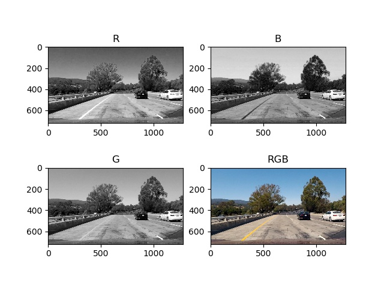
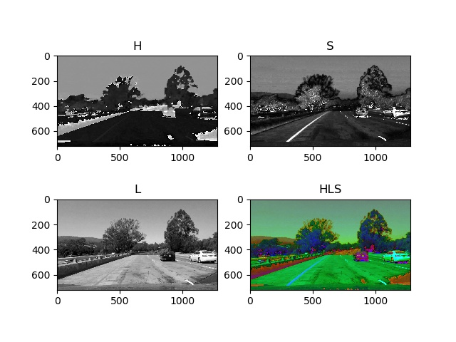
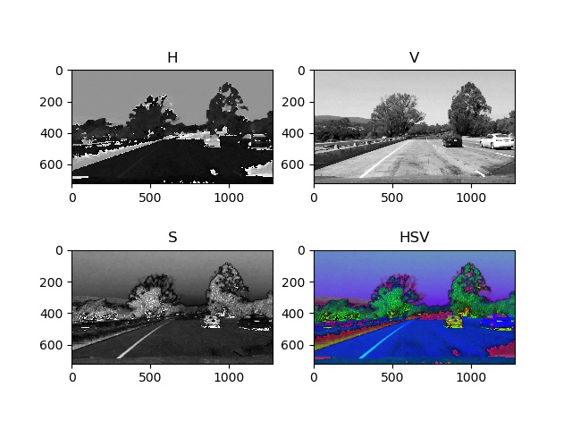
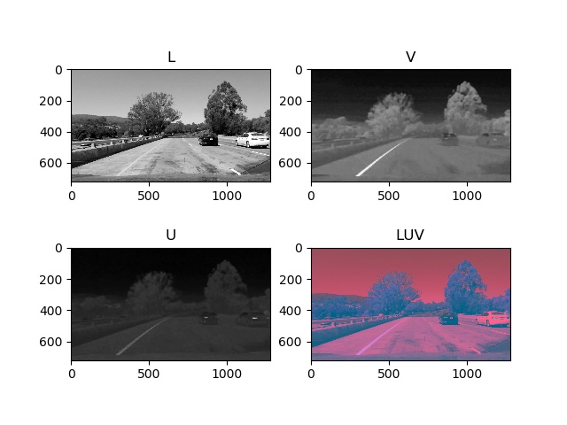
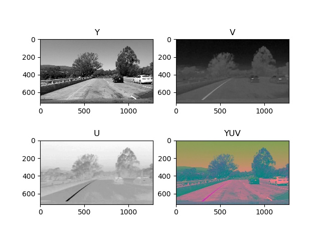
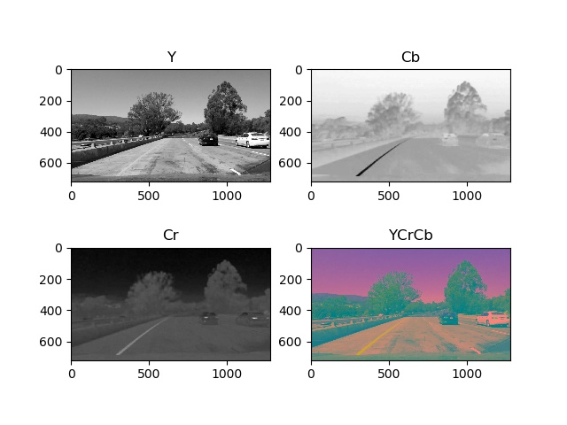

An easy measure if the channels or a combination of the three channels give make good features is how easy the cars can be identified on them. For example: In HLS space the black car has high intensity an the Hue Channel where the white car has a low intensity. On the L Channel of HLS space the white car has a high intensity and the black car doesn't. Hence, using only colors in different spaces would help detecting cars of a specific color but, used alone, makes it difficult to find a mixed variety of different color cars.
So in addition more global features must be found to predict cars.

#### 1.2 Advanced feature exploration
After taking a look at free literature on the Internet different approaches were found.
Commonly used to establish vehicle detection are Histogram of Oriented Gradients(HOG), Principal Component Analysis(PCA) and a few more. For this submission only HOG was used.
To observe different results hog gradients were created and displayed on different color channels. The images were created by the ```carFinder.showHogFeatures()``` method.

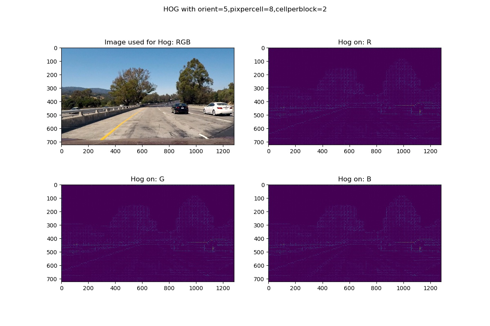
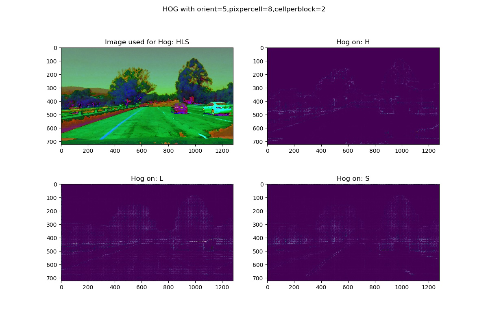
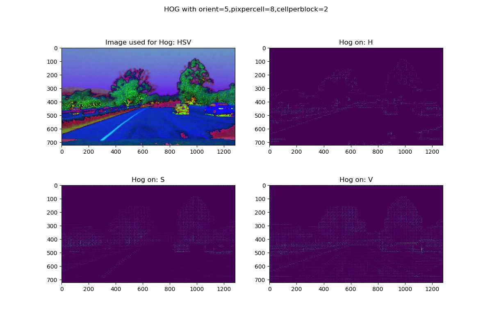

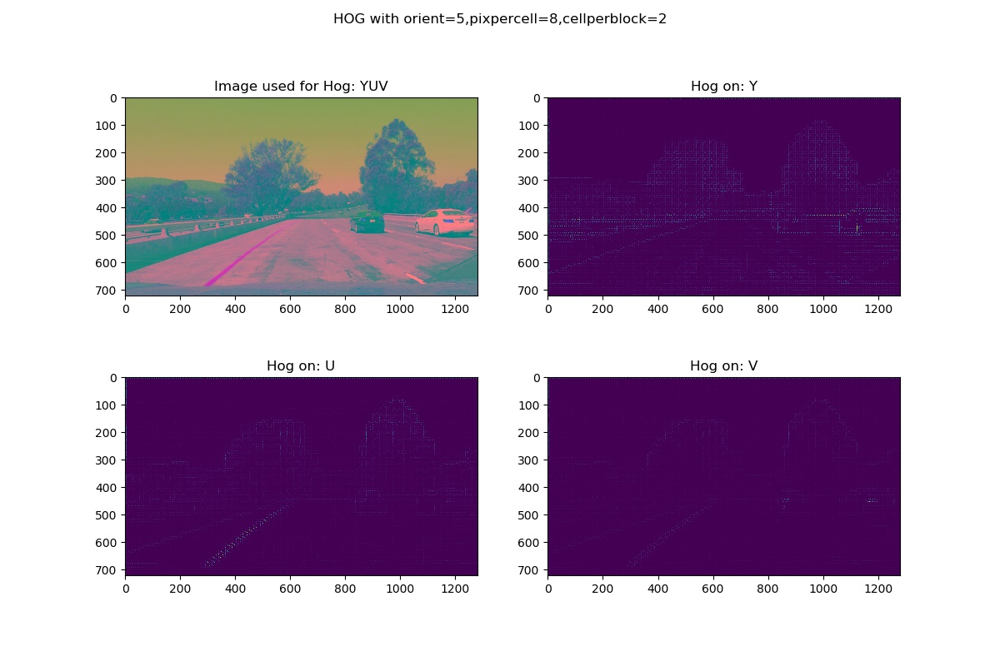
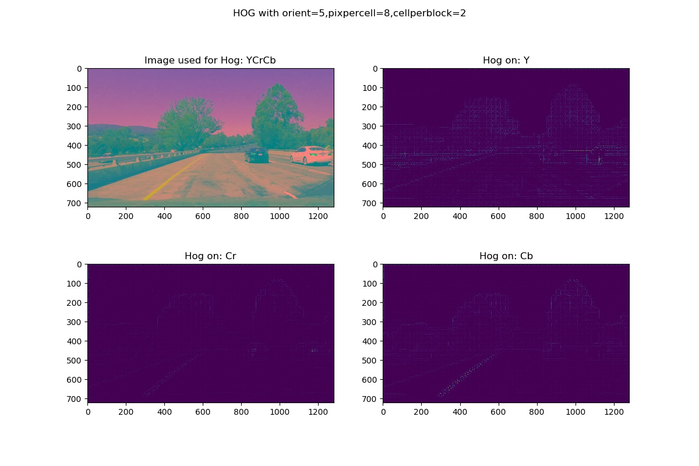

## 2 Feature extraction
For feature extraction 3 methods were implemented
1. ```carFinder.extractSpatial()``` returns a flattened feature vector of binned color after reducing the image size to ```spatial_size```.
2. ```carFinder.extractHist()``` returns a flattened feature vector of histogram of color on a 1 or 3 channel image with ```hist_bins``` bins.
3. ```carFinder.extractHog()``` returns a flattened feature vector of histogram of oriented gradients on a one channel image with ```pix_per_cell``` pixels per cell, and ```cells_per_block``` cells per block and a given number of orientations in ```orient```

The method ```carFinder.extractFeatures()``` calls the previously mentioned methods for the desired color spaces and corresponding channels to retrieve desired features.

## 2 Classifier

The support vector machnine: Linear Support Vector Classification ```LinearSVC()``` was used as classifier.
Prior to feeding data to the classifier the combined feature vectors were normalized by the ```StandardScaler()``` of the sklearn library.
The classifier is created in ```carFinder.createClassifier()``` method that automatically loads a saved classifier if desired. 


The training pipeline for the classifier was:

1. Data preparation:
The car and non car data was downloaded from aws and unzipped.
The data was briefly observed, but no data was removed risking a bit of a 'garbage in, garbage out' effect.
Loading the training data lists of car and non-care with the same length were returned, so the classifier was trined on evenly split car and no-car features. Shuffled training data was provided by the ```carFinder.loadImageSet()``` method.

2. Feature extraction:
Before using the images to train the LinearSVC(), the desired features were extracted using the ```carFinder.extractFeatures()``` method on each image.

3. Feature normilazazion:
Features were normalized using ```StandardScaler()``` of the sklearn libraray.

4. Training the classifier:
The classifier was trained with default settings in method ```carFinder.trainClassifier()```. Gamma and C values were not varied as general test accuracy on different training setups (all containing hog) were above 95%.
After training the classifier the ```LinearSVC()``` and ```StandardScaler()``` were saved to a pickle file with other key data like test accuracy.

## 3 Classifying vehicles on test_images, the test video and the project video
To test the performance of the trained classifier first of all the features have to be found on the image (or each image of the videos)

### 3.1 Sliding windows
2 Methods were implemented for different types of sliding window searches.
The first method was named ```carFinder.searchClassic()``` and takes region of interest, window_shape = (width,height) and an overlap = (overlap_x,overlap_y). The function creates a list of window coordinates that can then be used to look for features. The patches cut out by the single windows simply have be scaled to (64,64) and then run through the ```carFinder.extractFeatures()``` method to retrieve the features. The big disadvantage of this method is, that processing intesive HOG calculations are repeated for overlapping windows.
The second method (used in project submission video) was named ```carFinder.searchFullHog()```. It is also based on sliding window functionality but calculates the full HOG image(s) once for the defined region of interest. Then slices(windows) of the HOG image(s) are used depending on the ```scale``` given to the function.

### 3.2 Prediction and labeling
For each window a prediction was made by the classifier if a car is shown or not. Before predictions could be made the features had to be normalized by ```StandardScaler()``` and the fed to the classifier. If the prediction was positive for a car, the window was added to a list of windows containing predicted car images.
As multiple, also overlaying windows are detected the software has to merge these to single objects. For this purpose a heatmap is generated giving each pixel the intensity of the number of times it was within a window classified as 'car'. After creating the heatmap all values greater equal to 2 were kept. In the next step the connected areas were labeled and output as a detected car object. This information was processed by the method ```carFinder.heatmapAndLabel()```


*Additional step for video only*: To ensure only cars were detected a sanity check was implemented adding detected cars of previous frames as parent object to actual cars if the centroid of the object was within a tolerance of a previous frame object. If an object is detected for at least 15 frames it is output as a car object. The code can be found in the ```carFinder.drawLabeledBboxesVid()``` method.

## 4 Used parameters
After experimenting with different parameters considering various color spaces and channels for histogram features and HOG features, a HOG only approach was chosen. As color space 'YCrCb' was used processing HOG on all three channels. Especially the ```orientations``` property of hog seemed to make a difference. Where high ```orientations``` values caused the bounding boxes to be within the cars, moderately low values resulted in capturing larger bounding boxes and more false positives. This resulted in a  ```orientations``` parameter of 7 with a heatmap threshold of 3. False positives were excluded by using the sanity check explained in section 3.2.
For car detection multiple scalings were used on ```carFinder.searchFullHog()```:
```
cars_1 = self.searchFullHog(img,scale=0.8,region = (0,img.shape[1],350,500))
cars_2 = self.searchFullHog(img,scale=1.0,region = (0,img.shape[1],350,500))
cars_3 = self.searchFullHog(img,scale=1.2,region = (0,img.shape[1],400,500))
cars_4 = self.searchFullHog(img,scale=1.4,region = (0,img.shape[1],300,550))
cars_5 = self.searchFullHog(img,scale=1.6,region = (0,img.shape[1],350,550))
```

The reult can be found in ```project_video_augmented.mp4```
Unfortunately, the detection is not perfect. Espacially traffic signs are detected as cars as well.

## 5 Discussion
A major issue is the duration of the HOG calculation, especially on the large test images and video. On my machine it took around 4s to run the whole pipeline on one image. Considering requirements like real-time capability the pipeline takes 100 times longer than it is supposed/allowed to. Additionally I imagine that these kind of calculations run on within the camera hardware itself and only objects are passed on to the next electronic control unit. 
A second problem is the stability of the bounding box. If the bounding box does not represent the exact size of the vehicle in all frames it is hard to calculate parameters like lateral or longitudinal velocity of the detected vehicles. To prevent this Additional techiques like pca could be implemented, or a deeper calculation on found vehicles could be done.