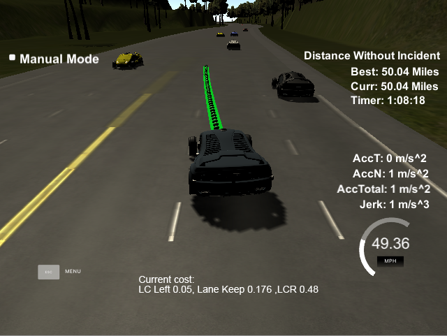

# PathPlanning
UDACITY Term 3 Poject 1 - Submission

#### Remarks
* All code can be found in src directory and important parts are commented to enhance understanding
* pathplanner.cpp file contains a class capable of path planning and trajectory generation
* helper functions were moved to herlpers.cpp
* CMakeLists.txt was edited to build additional files

## Information on project implementation
#### 1. Path Planning concept
The PathPlanning Project is based on predicting the surrounding traffic in frenet coordinates.
The prediction is separated into predicting the heading vehicle on the same lane every time the information from the simulator is retrieved and predicting the surrounding traffic around every second.
Due to the trajectory generation with the help of spline.h (done very similar to the project walkthrough) all relevant vehicles states(position, velocity) are predicted one second to the future.
In the trajectory generation method a speed controller is called using information about maximum velocity due to limitation and predicted speed of- and distance to the forward vehicle. The method sets a reference velocity used to calculate the distance of the next coordinate(s) in the vector sent to the simulator.
About once a second the surrounding vehicles are predicted and a desicion function is called. The method calculates costs for lane changes and lane keeping and sets the lane index if a safe lane change is possible and sensible.

#### 2. Trajectory generation
To guarantee smooth trajectories the method from the project walkthrough using spline.h was adopted and edited.
A trajectory is built onto the end of the previous trajectory depending on how many of the coordinates the car has passed in the simulator.
The negative effect of this way of trajectory generation is, that there is no manipulation inside the part that has already been generated in the previous loop.
For this reason the trajectory is generated with a horizon of one second (length: 50 coordinates with dt of .02 seconds).
To smoothen the trajectory speed dependent points ar used as anchors to then generate final smooth coordinates between these anchors.
By running the speed controller after each coordinate a smooth longitudinal velocity profile can be created.

#### 3. Lane Line decision
The decision to follow the current lane or change lanes is made by the cost functions inside the decide method. 
For cost calculations the vehicles current lane index is used as well as the surrounding vehicles (front_right, back_right, front_left, back_left).
The cost functions include predicted positions penalizing close vehicles and velocities penalizing fast rear and slow forward vehicles.