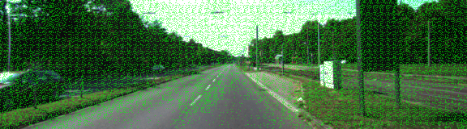

# SemanticSegmentation
UDACITY Term 3 Project 2 - Submission

#### Remarks
* Submission consists of the files main.py and project_tests.py
* The submissions results are located in runs/EPOCH_5_BATCH_2_KERNEL_INIT_0p0001
* Code is commented for enhanced understanding
* project_tests.py was slightly modified due to function argument extension in main.py
* mainL2.py and project_testL2.py was an (unsuccessful) approach to use L2 kernel regularizer

## Function description
#### load_vgg 
load_vgg loads the required layers from VGG 16 to provide pre-trained encoding layers.

#### layers
layers adds the decoding layers onto the encoding of layers loaded in load_vgg.
The important part of the function is to set the correct parameters (number of classes, kernel_size & padding) to the transpose layers to regain the original image size.
Additional information is gained through adding skip connections from the encoding layers to the equivalent decoding layer.

As all approaches using L2 kernel regularization failed a different approach was used in the project.
In order to keep initial values in a suitable range created layers in the function were will be initialized with ```tf.randomn_normal_initialyzer```. The importance of correct initialization will be shown in the Training and Results section

#### optimize
The only optimizer used in this project was Adam optimizer minimizing cross entropy with logits. 

#### train_nn
train_nn does the actual training operation by getting the labeled images from the training set using provided ```get_batches_fn``` from the helpers.py resource.

#### run
run initializes all tf_placeholders required and calls the functions described above.
It also contains the definition of the numbers of epochs, the batch_size, the keep probability and the learning rate.

## Training and Results
The nn was trained with a variety of different configurations. A massive impact on the result was made by changing the standard deviation of the kernel initializer based on tensorflow's randomn_normal_initialyzer.
Running the training on with five epochs, a batch size of 2, a learning rate of 0.0001 and a keep probability of 50% the standard deviation was varied every training loop.
The following images show the dependency of the quality of the classification in relation to the standard deviation of the kernel initializer:
##### Initializing random_normal_initializer with stddev = 0.01

##### Initializing random_normal_initializer with stddev = 0.001

##### Initializing random_normal_initializer with stddev = 0.0001

##### Initializing random_normal_initializer with stddev = 0.00001


##### Best results
The best results were achieved setting the kernel initializer to a standard deviation of 0.0001. Though there is no large difference to initializing the kernel with a standard deviation of 0.001.


